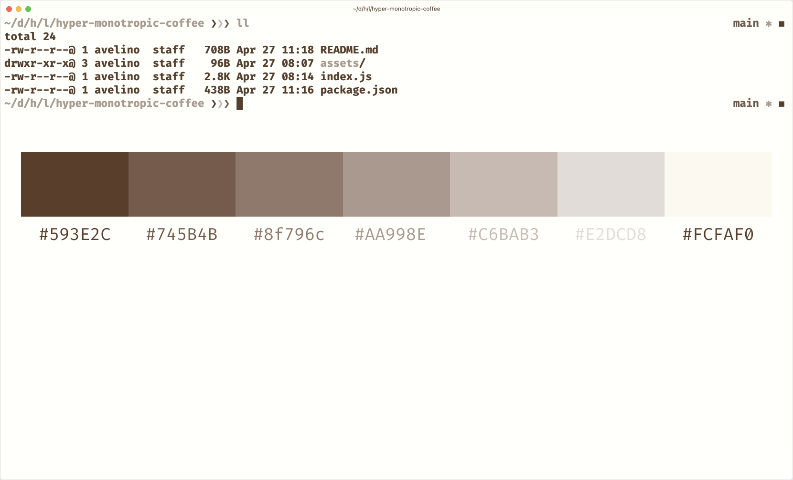

# Monotropic Coffee theme for Hyper

Monochrome theme with **coffee-based** colors for [Hyper](https://hyper.is), based in [Monotropic Coffee](https://github.com/avelino/monotropic-theme-vscode#monotropic-coffee).



## Installation

### Hyper plugin manager

Ensure you have [Hyper](https://hyper.is) installed. Then run the following from the command line:

```bash
hyper install monotropic-coffee-hyper
```

### Manually

Open your `~/.hyper.js` configuration file and add `"monotropic-coffee-hyper"` to your plugins:

```js
module.exports = {

  config: { /*... */ },

  plugins: [
    "monotropic-coffee-hyper"
  ]

};
```

## Complete the look

Styles shown in the screenshot:

```js
fontFamily: 'Fira Code',
padding: '12px 30px 30px 30px'
```
